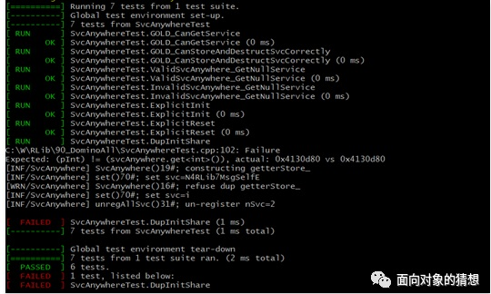

# Domino Library
Reuse-Library of C++, include classes eg:

1. ObjAnywhere ([手册*](https://mp.weixin.qq.com/s?__biz=Mzk0NzIzNzY0OQ==&mid=2247508838&idx=1&sn=eb306cff62c21a1770b130b0db39bccb&chksm=c37b0518f40c8c0e752f9377bf909d7c592252cedd9aab1e357b1f1e873e0b862d4ebc8e1664&token=853457497&lang=zh_CN#rd))

    How to get any **object anywhere** in a program directly (not by passing parameter)?

2. Domino(s) ([手册*](http://mp.weixin.qq.com/s?__biz=Mzk0NzIzNzY0OQ==&mid=2247508390&idx=1&sn=afc5728f38c2fd5a63db14f1c0f61f86&chksm=c37b07d8f40c8eceeddba4e032e23c3749b47ee09eed733c841d4e314dfd66d2c77646a16f6b&scene=21#wechat_redirect))

    How can a program **adaptively** perform at its best in any scenario?

3. MsgSelf ([手册*](http://mp.weixin.qq.com/s?__biz=Mzk0NzIzNzY0OQ==&mid=2247508384&idx=1&sn=86e1614b56deab11ee2474de3ba352f4&chksm=c37b07def40c8ec8ee0617d919b94bfe30aaa2993757b4ef00eb37c2853cf5a3e9e19a701d39&scene=21#wechat_redirect))

    How to avoid nested callback?

4. SmartLog ([手册*](http://mp.weixin.qq.com/s?__biz=Mzk0NzIzNzY0OQ==&mid=2247508416&idx=1&sn=f74d7dda6dc0c3c06f169b31a5f702a0&chksm=c37b07bef40c8ea85a040f396a210dedebc3eab6eb2347b40ee0e1ef6d3522a313752853ee92&scene=21#wechat_redirect))

    How to collect only error related logs? eg, only print for failed ut case(s):
    

**(*) English manual is not ready yet.**

# New Practices
1. UT testcase is requirement. (Refer to ./ut/\*/\*.cpp)

2. LEGO domino classes. (Refer to ./ut/obj_anywhere/UtInitObjAnywhere.hpp)

# Contributing
(not ready yet)

# Contact
sz.chen@nokia-sbell.com
